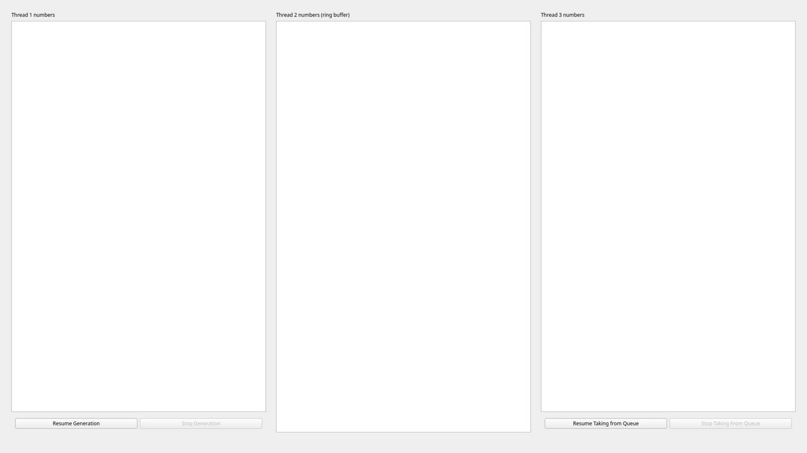
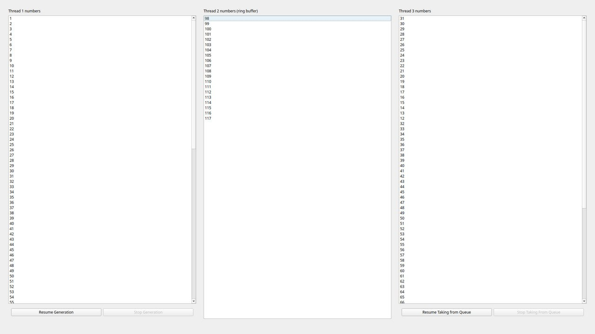

# QT Threading demo

## Overview

This project is a a demonstration of QT threading. It is done mostly using QT utils,
except for the `NumberQueue` - it uses a `std::vector` (which could be replaced by a `QList` if needed).

The setup was done using QtCreator so as to simplify the boilerplate generation.

## Thread tasks

1. **Thread 1 - Number Producer**
   - Continuously generates numbers incremented by 1, starting from 0.
   - The generation can be started and stopped by the user via the **Start/Stop** buttons in the GUI.
   - The numbers generated are displayed in a list box with an interval of approx. 100 millisecond

2. **Thread 2 - Queue (FIFO)**
   - Acts as a buffer that holds up to 20 numbers.
   - If more than 20 numbers are added to the queue, the oldest number is removed, and the newest number replaces it.
   - This thread runs independently, storing the numbers generated by Thread 1 - Thread 1 pushed to the queue.
   - A separate list box displays the current state of the queue.

3. **Thread 3 - Number Consumer**
   - Takes numbers from the queue (FIFO) and processes them.
   - This thread can also be started and stopped using a **Start/Stop** button in the GUI.
   - The processed numbers are displayed in a third list box.
   - Takes the numbers approx. each 20 milliseconds - a consumer acts faster than the producer.

## Application layout

Allication when launched:




Allication in progress:



## Widgets

The application features the following elements:
- **Three List Boxes:**
  - Each list box displays the real-time state of a specific thread:
    - **List Box 1:** Displays the numbers generated by Thread 1 (Number Generator).
    - **List Box 2:** Displays the current numbers in the queue (FIFO buffer).
    - **List Box 3:** Displays the numbers being processed by Thread 3 (Queue Processor).
  - These list boxes update at least 3 times per second to reflect the latest state.

- **Start/Stop Buttons for Thread 1 and Thread 3:**
  - **Thread 1:** Allows the user to start/stop the number generation.
  - **Thread 3:** Allows the user to start/stop the queue processing.

## Dependency Installation

### Linux

1. **Install QT**:
    ```bash
    sudo apt-get install qt6-base-dev qt6-base-dev-tools
    ```

2. **Install CMake**:
    ```bash
    sudo apt-get install cmake
    ```

3. **Install GCC or Clang** (if not already installed):
    ```bash
    sudo apt-get install build-essential
    ```

### Windows

1. **Install QT**:
   Download and install QT from [QT Downloads](https://www.qt.io/download). Be sure to install **Qt Creator** and choose the appropriate version of **MinGW** or **MSVC** toolchain.

2. **Install CMake**:
   Download and install CMake from the official site: [CMake Downloads](https://cmake.org/download/).

3. **Install MinGW** (optional if using MSVC):
   If you plan to use MinGW, you can install it via QT installer or separately from [Mingw-w64](https://sourceforge.net/projects/mingw-w64/).

## Build Instructions

1. Clone the repository:
    ```bash
    git clone https://github.com/pmozil/test-task-qt-threading
    ```

2. Navigate to the project directory:
    ```bash
    cd test-task-qt-threading
    ```

3. Create a build directory and navigate into it:
    ```bash
    cmake -B build
    ```

4. Run CMake to configure the project:
    ```bash
    cmake --build build
    ```

### Running the Application
Once the project is built, you can run the application directly from the build directory:
- On **Linux** and **macOS**:
   ```bash
   ./threads-demo-petro-mozil
   ```
- On **Windows**:
   Run the generated `.exe` file located in the `build` directory.

---

## License
This project is licensed under the MIT License. See the [LICENSE](LICENSE) file for more details.

---
